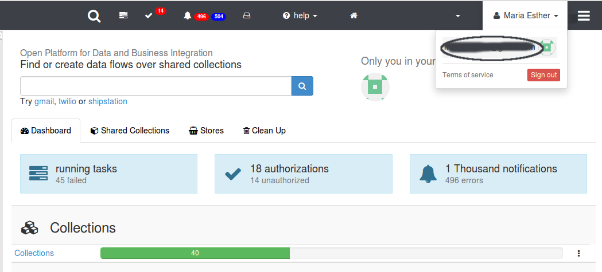
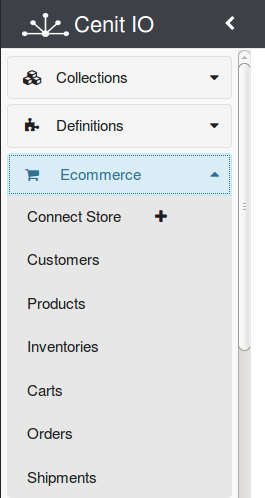
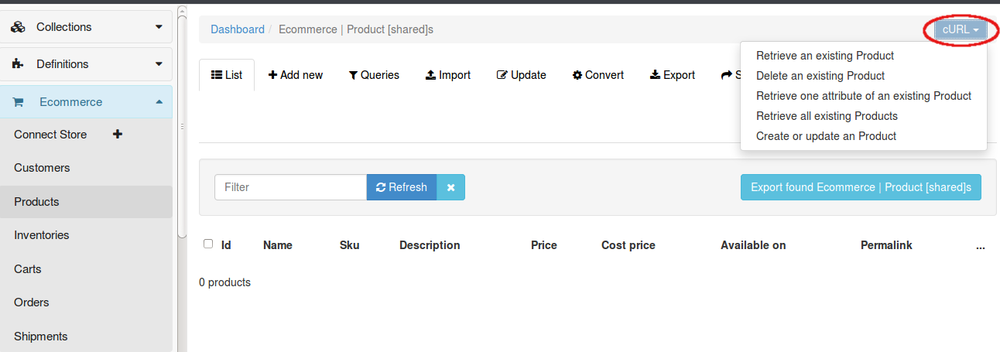

**Ecommerce's shared collection** in Cenit provides an easy way to manage and connect all your business data like orders, inventories, products and more.

[Cenit IO](https://cenit.io)  [(https://cenit.io)](https://cenit.io) is an Open Platform for Data and Business Integration (iPaaS) to process, storage and move data in connection with Cloud or On-Premise services. It has been designed to orchestrate data flows that may involve several kind of endpoints (APIs, Datasets, EDI). It makes possible the automation of all operational processes in a company, connecting between organization's on-premises infrastructure and cloud provider services.

# Creating an account in Cenit

The first thing you should do is create an account on [Cenit IO](https://cenit.io), it's free.

Then go to your account info in the top right:

and look for **Credentials**. Copy the **Key** and **Authentication token**. You'll use them when doing API requests.

# Ecommerce models

 In left pane, you'll see all Ecommerce models available. Also, you can add other models you need.

 

# API Requests

 You need the **Key** and **Authentication Token** for API requests.

 For example, for getting all products we can do:

  curl -X GET \   
       -H 'X-User-Access-Key: yourkey' \  
       -H 'X-User-Access-Token: yourkey' \   
       -H 'Content-Type: application/json' \   
       -d '{"page":1,"limit":25,"order":"id","where":"{}"}' \   
       'https://cenit.io/api/v1/ecommerce/product'

 Or creating a new product:

 curl -X POST \   
      -H 'X-User-Access-Key: yourkey' \   
      -H 'X-User-Access-Token: yourkey' \   
      -H 'Content-Type: application/json' \   
      -d '{"_id":"","name":"","sku":"","description":"","price":0,"cost_price":0,"available_on":"","permalink":"","meta_description":"","meta_keywords":"","shipping_category":"","options":[],"taxons":[],"properties":{},"variants":[],"images":[]}' \   
      'https://cenit.io/api/v1/ecommerce/product'

 Also, you can directly go to Ecommerce models in your Cenit account, select **CURL** and see all available options through the API.

 

